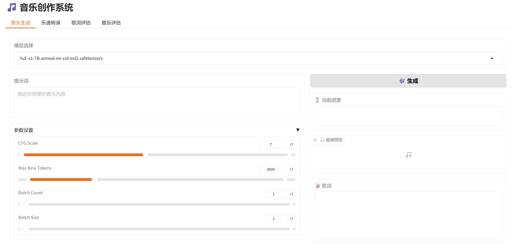

# 🎵 music-webui

**music-webui** 是一个基于 Gradio 的音乐生成 Web 界面工具，支持从歌词生成、音乐创作到自动乐谱转录与风格评估的一体化操作。用户只需通过网页交互，即可完成完整的音乐生成流程。



---

## ✨ Features

- **一体化音乐创作流程**  
  用户可通过提示词输入，自动完成以下操作：
  - 歌词生成
  - 歌曲旋律创作
  - 乐谱转录（MIDI/简谱）
  - 歌词-音乐一致性评估

- **可扩展模型支持**  
  兼容多个 Hugging Face 上的音乐/歌词生成模型及评估模型，用户可根据需求自由替换和扩展。

---

## 🚀 安装步骤

1. **克隆项目代码**
   ```bash
   git clone https://github.com/FengJin1117/music-webui.git
   cd music-webui
   ```

2. **配置环境依赖**
   ```bash
   ./webui.sh
   ```

3. **配置模型**

   - 🎼 **生成模型**：  
     请将从 [Hugging Face](https://huggingface.co) 下载的音乐/歌词生成模型放入：
     ```
     music-webui/models/
     ```

   - 🧠 **评估模型（可选）**：  
     若使用歌词-音乐一致性评估功能，请将评估模型放入对应路径，例如：
     ```
     music-webui/evals/
     ```

4. **运行程序**
   ```bash
   ./run.sh
   ```

---

## 📌 注意事项

- 建议使用 Python 3.9+ 环境运行本项目。
- 初次运行可能需较长时间加载模型，请耐心等待。
- 可根据 `config.yaml` 修改默认模型和界面配置。

---

欢迎对本项目提出建议或提交 PR 🙌  
更多功能即将上线，敬请期待！
